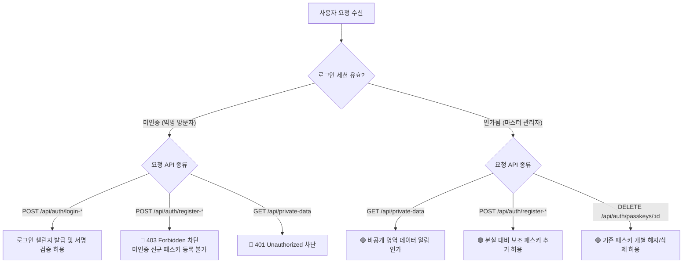

# [T08 - 카드 7] (보안 아키텍처 분석) 비인가 패스키 공개 등록 취약점 및 상용 격리 설계서

## 1. 개요 및 문제의식 (Vulnerability Analysis)
- **핵심 질문:** *"비공개 영역을 잠그기 위한 시스템인데, 로그인 화면에서 누구나 새 패스키를 등록할 수 있다면 모순 아닌가?"*
- **현상 분석:**
  - 현재 화면(잠금 상태) 하단에 `[✨ 이 기기로 새 패스키 등록]` 버튼이 노출되어 있음.
  - 이 상태 그대로 공용 인터넷(Public Web)에 배포할 경우, 임의의 방문자나 공격자가 자신의 기기(스마트폰/노트북)로 패스키를 신규 등록하여 손쉽게 비공개 영역에 침입할 수 있는 **구조적 인가 우회(Authentication Bypass) 취약점**이 존재함.
- **분석 목표:**
  - 로컬 학습/과제 검증 환경과 실제 상용 프로덕션 환경의 차이를 명확히 이해하고,
  - 상용 배포 시 패스키 등록(Enrollment) 파이프라인을 안전하게 격리·보호하는 아키텍처 설계 수립.

---

## 2. 과제 환경 vs 실제 상용 프로덕션 환경 대조

| 비교 항목 | 현재 과제 환경 (로컬 실습/채점용) | 실제 상용 프로덕션 환경 (배포용) |
| :--- | :--- | :--- |
| **운영 형태** | 로컬호스트(`localhost:3000`) 1인 실습 | 공용 인터넷(Public Domain) 불특정 다수 접근 |
| **등록 버튼 위치** | 잠금 화면(Locked View) 대문짝에 노출 | 잠금 화면에서 **완전 제거** (노출 금지) |
| **등록 가능 대상** | 누구나 즉시 등록 가능 (실습 편의) | 오직 **인증된 소유자 본인**만 추가 기기 등록 가능 |
| **존재 이유** | 카드 2(등록) 및 카드 4(2번째 기기 등록)를<br>로컬에서 간편하게 채점·검증하기 위한 임시 UI | 보안 사고(데이터 유출)를 유발하는 심각한 취약점이므로 **원천 차단** 필수 |

---

## 3. 상용 배포를 위한 3대 보안 개선 아키텍처

### 원칙 1. 잠금 화면(Locked View)의 순수 인증 전용화
* **UI/UX 조치:** 미인증 잠금 화면에서는 `[새 패스키 등록]` 버튼과 별칭 입력창을 완전히 제거.
* **허용 인터페이스:** 오직 이미 등록된 마스터 패스키로만 문을 열 수 있는 **`[🔐 등록된 패스키로 로그인]`** 버튼만 노출.
* **API 차단:** 세션이 없는 익명 사용자의 `POST /api/auth/register-options` 호출 차단.

### 원칙 2. 다중 패스키 등록(Card 4)의 인가 세션 격리
* **등록 권한 격리:** 잃어버릴 때를 대비한 2번째 보조 기기(아이폰, 서브 노트북 등) 등록은 **반드시 1차 로그인에 성공한 관리자 세션(Unlocked View) 내부**에서만 수행.
* **실무 동작 흐름:**
  1. 관리자가 PC에서 Windows Hello로 비공개 대시보드 로그인 성공.
  2. 대시보드 내부 `[⚙️ 인증 및 기기 관리] ➔ [+ 새 기기 패스키 추가]` 클릭.
  3. 화면에 1회용 QR코드가 생성되면, 서브 폰으로 스캔하여 블루투스(FIDO2 hybrid) 또는 동일 Wi-Fi 상에서 보조 패스키 등록.

### 원칙 3. 최초 1회 부트스트랩(Bootstrap) 및 자동 잠금
* **초기 설정(Initial Setup):** 서버 최초 배포 시 패스키가 0개인 상태에서 딱 1번만 소유자 마스터 패스키를 등록 허용.
* **등록 엔드포인트 자동 봉인:**
  ```javascript
  // 서버 미들웨어 예시
  if (passkeyStorage.length > 0 && !req.session.authenticated) {
    return res.status(403).json({
      error: "Forbidden",
      message: "신규 패스키 등록이 잠겨 있습니다. 관리자 로그인 후 추가하세요."
    });
  }
  ```
* 1개라도 패스키가 등록된 이후에는 공개 등록 요청을 `403 Forbidden`으로 영구 잠금 처리.

---

## 4. 백엔드 엔드포인트 인가 흐름도 (Mermaid)



---

## 5. 포트폴리오 및 면접 시 어필 포인트 (Architectural Insight)

이 문서는 단순 과제 구현을 넘어, **웹 인증 시스템의 근본적인 한계와 배포 시의 취약점을 비판적 시각에서 주도적으로 분석한 결과물**입니다.

- **과제 8 제출서류(`flow.md`) 활용:**
  - `[5. AI와 내 판단]` 및 `[월간 학습 회고록]`에 다음 내용을 기술하여 채점관에게 높은 평가를 유도:
    > *"과제 기본 UI는 다중 기기 등록(Card 4) 검증 편의를 위해 잠금 화면에 등록 버튼이 열려 있으나, 이는 실제 배포 시 인가 우회 취약점이 됨을 분석함. 따라서 상용 배포를 대비하여 **① 잠금 화면 내 등록 UI 제거, ② 신규 기기 등록을 인가된 세션 내부로 격리, ③ 최초 등록 후 엔드포인트 자동 봉인(Bootstrap Lock)** 구조를 도출함."*
- **기술 면접 질문 대응:**
  - *"패스키 등록 과정에서 발생할 수 있는 보안 취약점은 무엇인가?"*라는 질문에 대해, 인증 상태와 등록 상태의 결합 분리(Auth-Enrollment Separation) 이론을 완벽하게 설명할 수 있는 핵심 무기가 됨.
